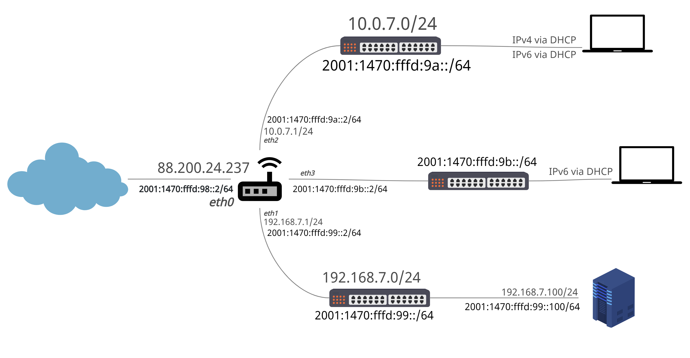

# kp2020-21
Projekt za seminarsko nalogo pri predmetu Komunikacijski Protokoli

## Shema omrežja



Omrežje je razdeljeno na 3 segmente, z zunanjim internetom pa ga povezuje **vyos** router z javnim IPv4 naslovom **88.200.24.237** in IPv6 naslovom **2001:1470:fffd:98::2/64**

Med segmenti delimo:
- **javno** podomrežje ```subnet4 192.168.7.0/24``` ter ```subnet6 2001:1470:fffd:99::/64``` do katerega dostopamo preko priključka ```eth1```
- **interno** podomrežje ```subnet4 10.0.7.0/24``` ter ```subnet6 2001:1470:fffd:9a::/64``` do katerega dostopamo preko priključka ```eth2```
- **ipv6only** podomrežje ```subnet6 2001:1470:fffd:9b::/64``` do katerega dostopamo preko priključka ```eth3```

Priključki (interfaces):
- **eth0** je povezan z zunanjim internetom, in sicer na naslovu ```IPv4 88.200.24.237/24``` in ```IPv6 2001:1470:fffd:98::2/64```
- **eth1** je povezan s stikalom ```sk07-dmz``` in sicer na naslovu ```IPv4 192.168.7.1/24``` in ```IPv6 2001:1470:fffd:99::2/64```
- **eth2** je povezan s stikalom ```sk07-internal``` in sicer na naslovu ```10.0.7.1/24``` in ```IPv6 2001:1470:fffd:9a::2/64```
- **eth3** je povezan s stikalom ```sk07-ipv6only``` in sicer na naslovu ```IPv6 2001:1470:fffd:9b::2/64```

## Uporaba SSH protokola za zunanji dostop do naprav
Za lažji in manj okreten nadzor sta **vyos** usmerjevalnik in **javni Ubuntu strežnik** dostopna za upravljanje preko ssh protokola, kjer se za dostop preverja uporabniško ime in geslo uporabnika za ta sistem.

**dostopnosti:**
- do usmerjevalnika vyos lahko dostopamo z ukazom ```ssh vyos@88.200.24.237 -p 312```
- do strežnika Ubuntu, priklopljenega na *sk07-dmz* stikalo, lahko dostopamo z ukazom ```ssh gazic@88.200.24.237 -p 3001```

Seveda ne gre brez omembe, da je pri obeh potrebno vedeti tudi geslo za uporabnika, s katerim se želimo prijaviti

## Osnovna VyOS konfiguracija

Za pravilno komunikacijo v omrežju, je bilo na usmerjevalniku VyOS nastaviti osnovno konfiguracijo za DNS in DHCP. Za DNS omrežje ne uporablja lastnega DNS strežnika, temveč zahteve posreduje (```dns-forwarding```) na Googlov ali ARNESov DNS strežnik na naslovih ```IPv4 8.8.8.8, IPv6 2001:4860:4860::8888``` (Googlov primarni DNS strežnik) in ```IPv4 193.2.1.66 IPv6 2001:1470:8000::66``` (ARNESov primarni DNS strežnik).

\\TODO: DHCP ko poštimam NPTv6

## NAT konfiguracija usmerjevalnika
### DNAT (Destination NAT)
#### SSH dostop
V prejšnem razdelku kofniguracije SSH protokola lahko opazimo, da se za vzpostavitev povezave pri nobeni izmed naprav ne uporabljajo standardna vrata za ssh protokol (**22**).
To smo med drugim omogočili tudi s konfiguriranjem preslikovanja naslovov, kjer smo ves promet vrat **3001** preusmerili na priključek ```eth1``` preko ```sk07-dmz``` stikala na naslov ```192.168.7.100``` na vrata **22**, na katerem je dostopen naš **javni Ubuntu strežnik**, ki posluša za promet na vratih **22** (nameščen je <a href="https://www.openssh.com/">**openssh**</a>).
```bash
rule 10 {
    description "Server ssh"
    destination {
        port 3001
    }
    inbound-interface eth0
    protocol tcp
    translation {
        address 192.168.7.100
        port 22
    }
}
```
#### HTTP dostop
Naš ubuntu strežnik zunanjemu svetu nudi **RESTful API**, in sicer na vratih **3000**. Da lahko do virov dejansko dostopamo iz zunanjega sveta, je na usmerjevalniku dodana konfiguracija za preusmeritev prometa iz iz vrat **3000** na priključek ```eth1``` na naslov ```192.168.7.100:3000```.
```bash
rule 420 {
    description "server forwarding"
    destination {
        port 3000
    }
    inbound-interface eth0
    protocol tcp
    translation {
        address 192.168.7.100
    }
}
```
Skonfigurirana je tudi preusmeritev za ves promet na vratih **80**, ki se prav tako preusmeri do strežnika, kjer je na enakih vratih s pomočjo podpore *Apache2* servirana *Cacti* nadzorna stran za *SNMP monitoring*
```bash
rule 30 {
    description "80 for cacti"
    destination {
        port 80
    }
    inbound-interface eth0
    protocol tcp
    translation {
        address 192.168.7.100
    }
}
```
### SNAT (Source NAT)

//todo matic

### Konfiguracija Požarnih zidov

#### Vyos

//todo matic
 
#### Javni Ubuntu strežnik
Za Ubuntu strežnik, ki ga uporabljamo za serviranje **RESTApi-ja** ter statične spletne strani za monitoring (**cacti**), je konfiguracija potekala takole:

najprej smo skonfiguriali dostop za ssh
```bash
gazic@gazic:~$ sudo ufw allow ssh
```
kar nam je omogočilo promet skozi vrata **22** s protokolom **tcp** za IPv4 in IPv6 promet.
Nato je bilo potrebno dovoliti dostop do statične spletne strani, ki jo serviramo s pomočjo **Apache2** in sicer na vratih **80**
```bash
gazic@gazic:~$ sudo ufw allow 80/tcp
```
Tako smo omogočili komunikacijo preko protokola tcp skozi vrata 80 s katerega koli naslova.
nato je bilo potrebno odpreti še vrata za RESTApi, ki ga serviramo na vratih **3000**, prav tako preko **tcp** protokola.
```bash
gazic@gazic:~$ sudo ufw allow 3000/tcp
```
Za princip testiranja poskušamo izvajati vzorčne klice s *snmp* orodjem iz ubuntu sistema, ki je priključen v internem podomrežju, zato bomo vrata **161** preko protokola **udp** (snmp komunicira preko udp), odrpli le za ves promet, ki prihaja iz podomrežja ```10.0.7.0/24```
```bash
gazic@gazic:~$ sudo ufw allow from 10.0.7.0/24 to any port 161 proto udp
```
Po končani konfiguraciji lahko z ukazom ```sudo ufw status numbered``` prikažemo vsa nastavljena pravila za naš Ubuntu sistem
```bash
gazic@gazic:~$ sudo ufw status numbered
Status: active

     To                         Action      From
     --                         ------      ----
[ 1] 22/tcp                     ALLOW IN    Anywhere
[ 2] 3000/tcp                   ALLOW IN    Anywhere
[ 3] 80/tcp                     ALLOW IN    Anywhere
[ 4] 161/udp                    ALLOW IN    10.0.7.0/24
[ 5] 22/tcp (v6)                ALLOW IN    Anywhere (v6)
[ 6] 3000/tcp (v6)              ALLOW IN    Anywhere (v6)
[ 7] 80/tcp (v6)                ALLOW IN    Anywhere (v6)
```
### RESTful API storitev
Na Ubuntu strežniku, ki je dostopen javnosti, na vratih 3000 serviramo Stateless mikrostoritev **Sledilnik števila obiskovalcev**, ki služi kot pripomoček za sledenje števila oseb v zaprtih prostorih ter za kreiranje statistike in poročil o trendih zasedenosti. 
Dostopna točka med drugim omogoča tudi vnos konfiguracijo omejitve števila obiskovalcev na kvadratni meter, na podlagi katere se izračuna dovoljeno število obiskovalcev v prostoru.
#### Nameščanje Aplikacije
**Javansko** aplikacijo s pomočjo orodja **Docker** strežemo v vsebniku, ki je izpostavljen na vratih 3000, hkrati moramo v še enem dodatnem vsebniku poganjati **Postgresql** podatkovno bazo, ki je brezpogojna za celotno funckionalnost aplikacije.
##### Nameščanje okolja docker
Najprej smo izvedli najbolj potreben ukaz za vse OCD razvijalce
```bash
gazic@gazic:~$ sudo apt update
```
Nato smo dodali knjiznjice, ki so sistemu ```apt``` dovolile prenos novih knjiznjic preko HTTPS
```bash
gazic@gazic:~$ sudo apt install apt-transport-https ca-certificates curl software-properties-common
```
Naslednji korak je bil ta, da smo dodali GPG ključ, ki nam je omogočil prenos datotek iz uradnega Docker repozitorija
```bash
gazic@gazic:~$ curl -fsSL https://download.docker.com/linux/ubuntu/gpg | sudo apt-key add -
```
Nato smo dodali Docker repozitorij med repozitorije, ki so znani programu ```apt``` 
```bash
gazic@gazic:~$ sudo add-apt-repository "deb [arch=amd64] https://download.docker.com/linux/ubuntu focal stable"
```
ponovno smo zagnali ocd ukaz (tokrat brezpogojno)
```bash
gazic@gazic:~$ sudo apt update
```
Nato smo lahko končno pognali ukaz za prenos in namestitev docker okolja
```bash
gazic@gazic:~$ sudo apt install docker-ce
```
Nato smo preverili delovanje
```bash
gazic@gazic:~$ sudo systemctl status docker
● docker.service - Docker Application Container Engine
     Loaded: loaded (/lib/systemd/system/docker.service; enabled; vendor preset: enabled)
     Active: active (running) since Wed 2021-01-06 12:01:47 CET; 3h 30min ago
TriggeredBy: ● docker.socket
       Docs: https://docs.docker.com
   Main PID: 1057 (dockerd)
      Tasks: 30
     Memory: 179.5M
     CGroup: /system.slice/docker.service
             ├─1057 /usr/bin/dockerd -H fd:// --containerd=/run/containerd/containerd.sock
```
##### Namestitev dodatka Docker Compose
Da smo lahko našo aplikacijo zagnali karseda lahko in brez dolgih spisov v ukazni vrstici, smo namestili orodje **Docker Compose**, ki služi kot nekaksen dinamičen organizator docker vsebnikov.

Da smo prenesli res najnovejšo verzijo orodja, smo to storili preko njihovega uradnega <a href="https://github.com/docker/compose">Github repozitorija</a>.
```bash
gazic@gazic:~$ sudo curl -L "https://github.com/docker/compose/releases/download/1.27.4/docker-compose-$(uname -s)-$(uname -m)" -o /usr/local/bin/docker-compose
```
Slednji ukaz je prenesel in shranil ```executable``` datoteko **docker-compose** v lokalno shrambo uporabnika ```/usr/local/bin/docker-compose```, kar je omogočilo, da smo lahko izvedli program kar z ukazom ```$ docker-compose```. Seveda je bilo potrebno nastaviti tudi temu primerne pravice.
```bash
gazic@gazic:~$ sudo chmod +x /usr/local/bin/docker-compose
```
Namestitev smo preverili z:
```bash
gazic@gazic:~$ docker-compose --version
docker-compose version 1.27.4, build 40524192
```
##### Postavitev aplikacije in strežba
Slika aplikacije se nahaja na DockerHub repozitoriju **mrzic/trendi**. Priraviti je bilo potrebno ustrezeno docker-compose.yml datoteko, da smo lahko efektivno pognali celotno aplikacijo.
```bash
gazic@gazic:~$ cd ~
gazic@gazic:~$ touch docker-compose.yml
gazic@gazic:~$ nano docker-compose.yml
```
Prilepili smo naslednjo vsebino in shranili.
```yaml
version: "3"
services:
  database:
    container_name: postgres-trendi
    image: postgres:latest
    restart: always
    environment:
      POSTGRES_DB: trendi
      POSTGRES_USER: postgres
      POSTGRES_PASSWORD: postgres
    volumes:
      - database-data:/var/lib/postgresql/data/
    ports:
      - "5432:5432"
    networks:
      - omrezje
  obiskovalci:
    container_name: obiskovalci
    image: mrzic/trendi:latest
    restart: always
    ports:
      - "3000:8080"
    depends_on:
      - database
    links:
      - database
    networks:
      - omrezje
networks:
  omrezje:
volumes:
  database-data:
```
Nato smo pognali docker-compose
```bash
gazic@gazic:~$ docker-compose up -d
Creating network "gazic_omrezje" with the default driver
Creating postgres-trendi ... done
Creating obiskovalci     ... done
gazic@gazic:~$ docker ps
CONTAINER ID   IMAGE                 COMMAND                  CREATED         STATUS         PORTS                    NAMES
436b992f7c37   mrzic/trendi:latest   "java -jar api-1.0-S…"   7 seconds ago   Up 5 seconds   0.0.0.0:3000->8080/tcp   obiskovalci
5eb24d2d425c   postgres:latest       "docker-entrypoint.s…"   7 seconds ago   Up 6 seconds   0.0.0.0:5432->5432/tcp   postgres-trendi
```
Kot lahko vidimo je vsebnik, v katerem se streže RESTful API izpostavljen na vratih **3000** ( *vsebnik "obiskovalci"* ).

Sedaj lahko v brskalniku preverimo delovanje naše RESTful API točke tako, da poskušamo pridobiti **OpenApi** dokumentacijo na naslovu <a href="http://88.200.24.237:3000/api-specs/ui">http://88.200.24.237:3000/api-specs/ui</a>.

### SNMP monitoring preko grafičnega vmesnika Cacti
Da smo lahko na ubuntu sistemu servirali grafični vmesnik preko brskalnika, smo bili primorani zagotoviti naslednje:
- RRDTool 1.0.49 ali več
- MySQL 5.x ali več
- PHP 5.1 ali več
- Spletni strežnik, ki podpira PHP (**v našem primeru je bil to Apache**)
#### Namestitev potrebščin
Najprej je bilo potrebno posodobiti vse sistemske pakete
```bash
gazic@gazic:~$ sudo apt update && sudo apt upgrade
```
Namestili smo Apache2 Spletni Strežnik
```bash
gazic@gazic:~$ sudo apt install -y apache2 libapache2-mod-php
```
Namestili smo PHP in vse potrebne pakete
```bash
gazic@gazic:~$ sudo apt install -y php php-mysql php-snmp php-curl php-xml php-gd php-ldap php-mbstring php-gmp php-json php-common
```
Namestili smo MariaDB strežnik
```bash
gazic@gazic:~$ sudo apt install -y mariadb-server mariadb-client
```
Namestili smo SNMP in RRDtool
```bash
gazic@gazic:~$ sudo apt install -y snmp snmpd snmp-mibs-downloader rrdtool librrds-perl
```
#### Konfiguracija PHP-ja
Nato smo konfigurirali dve **php** datoteki, ki sta potrebni za nemoteno izvajanje Cacti vmesnika
```bash
gazic@gazic:~$ sudo nano /etc/php/7.4/apache2/php.ini
gazic@gazic:~$ sudo nano /etc/php/7.4/cli/php.ini
```
V obe smo prilepili naslednje vrstice:
```ini
date.timezone = "Europe/Berlin"
memory_limit = 512M
max_execution_time = 60
```
Po končanem zgornjem opravilu smo resetirali storitev apache2.
```bash
gazic@gazic:~$ sudo systemctl restart apache2
```
#### Konfiguracija MariaDB podatkovnega serverja
z naslednjim ukazom smo uredili datoteko ```50-server.cnf```. Možno je, da je na drugem sistemu ta datoteka poimenovana drugače, ampak zagotovo je b obliki ```XX-server.cnf```.
```bash
gazic@gazic:~$ sudo nano /etc/mysql/mariadb.conf.d/50-server.cnf
```
Pod sekcijo **[mysql]** smo prilepili naslednje ter shranili.
```cnf
collation-server = utf8mb4_unicode_ci
max_heap_table_size = 128M
tmp_table_size = 128M
join_buffer_size = 256M
innodb_file_format = Barracuda
innodb_large_prefix = 1
innodb_buffer_pool_size = 2048M
innodb_flush_log_at_timeout = 3
innodb_read_io_threads = 32
innodb_write_io_threads = 16
innodb_io_capacity = 5000
innodb_io_capacity_max = 10000
innodb_buffer_pool_instances = 21
```
Nato smo ponovno zagnali MariaDB storitev
```bash
gazic@gazic:~$ sudo systemctl restart mysql
```
#### Kreacija podatkovne baze za Cacti
Najprej smo vstopili v lupino MariaDB strežnika
```bash
gazic@gazic:~$ sudo mysql -u root -p
```
Nato smo izvedli naslednje zaporedje ukazov, kjer smo med drugim besedo 'password' zamenjali z poljubnim geslom \*\*\*\*\*\*\*.
```bash
MariaDB [(none)]> create database cacti;
MariaDB [(none)]> GRANT ALL ON cacti.* TO cactiuser@localhost IDENTIFIED BY '******';
MariaDB [(none)]> flush privileges;
MariaDB [(none)]> exit
```
Vnesli smo podatkovno bazo časovnih območij v MariaDB strežnik
```bash
gazic@gazic:~$ sudo mysql -u root -p mysql < /usr/share/mysql/mysql_test_data_timezone.sql
gazic@gazic:~$ sudo mysql -u root -p
```
In dovolili uporabniku za Cacti (cactiuser) nad njo SELECT pravice
```bash
MariaDB [(none)]> GRANT SELECT ON mysql.time_zone_name TO cactiuser@localhost;
MariaDB [(none)]> flush privileges;
MariaDB [(none)]> exit
```
#### Prenos in namestitev Cacti vmesnika
Najprej smo se premaknili v mapo, kjer apache2 streže naše statične datoteke, in prenesli zandjo različico programa Cacti
```bash
gazic@gazic:~$ cd /var/www/html
gazic@gazic:~/var/www/html$ sudo rm index.html
gazic@gazic:~/var/www/html$ sudo wget https://www.cacti.net/downloads/cacti-latest.tar.gz
...
gazic@gazic:~/var/www/html$ sudo tar zxvf cacti-latest.tar.gz
...
gazic@gazic:~/var/www/html$ cd cacti-1.2.16/
gazic@gazic:~/var/www/html/cacti-1.2.16$ sudo mv * /var/www/html/
```
Vnesli smo podatkovno bazo od Cacti v MariaDB strežnik
```bash
gazic@gazic:~$ sudo mysql -u root -p cacti < /var/www/html/cacti.sql
```
Potrebno je bilo nastaviti tudi pravilne podatke v konfiguracijski datoteki za MySql od Cacti
```bash
gazic@gazic:~$ sudo nano /var/www/html/include/config.php
```
poiskali smo vrstico z vrednostjo **$database_password = 'cactiuser'** in jo spremenili v **$database_password = '\*\*\*\*\*\*\*'** in shranili.

Nato smo nastavili pravice in lastnika Cacti mape skupini **www-data** in shranili datoteko za spremljanje in zapisovanje dogodgov (log)
```bash
gazic@gazic:~$ sudo touch /var/www/html/log/cacti.log
gazic@gazic:~$ sudo chown -R www-data:www-data /var/www/html/*
```

Ponovno smo zagnali apache2 storitev
```bash
gazic@gazic:~$ sudo systemctl restart apache2
```
Cacti je bil tokrat dostopen na spletnem naslovu <a href="http://88.200.24.237/cacti">http://88.200.24.237/cacti</a>.

Šli smo še korak dlje in uredili zapisnik od strežnika Apache2, tako da Cacti ne bi bil dostopne na naslovu /cacti ampak kar na korenskem naslovu
```bash
gazic@gazic:~$ sudo nano /etc/apache2/sites-enabled/cacti.conf
```
Vstavili naslednje
```conf
Alias /cacti /var/www/html
<Directory /var/www/html>
Options +FollowSymLinks
AllowOverride None
<IfVersion >= 2.3>
Require all granted
</IfVersion>
<IfVersion < 2.3>
Order Allow,Deny
Allow from all
</IfVersion>
AddType application/x-httpd-php .php
<IfModule mod_php.c>
php_flag magic_quotes_gpc Off
php_flag short_open_tag On
php_flag register_globals Off
php_flag register_argc_argv On
php_flag track_vars On
# this setting is necessary for some locales
php_value mbstring.func_overload 0
php_value include_path .
</IfModule>
DirectoryIndex index.php
</Directory>
```
in ponovno zagnali Apache2 storitev
```bash
gazic@gazic:~$ sudo systemctl restart apache2
```
Cacti je trenutno dostopen na spletni strani <a href="http://88.200.24.237">http://88.200.24.237</a>.

Namestitev smo dokončali v brskalniku, kjer smo se v vmesnik vpisali z uporabniškim imenom **admin** in geslom **admin**. Cacti nas je nato prisilil v ponovno nastavljanje gesla.

#### Dodan polling za cacti
S pomočjo **cron.service** daemona lahko izvajamo periodične poizvedbe sistema, to zagotovimo tako, da ustvarimo novo datoteko **cactipoller**
```bash
gazic@gazic:/$ sudo nano /etc/cron.d/cactipoller
```
in vanjo prilepimo naslednje:
```bash
*/5 * * * * gazic php /var/www/html/poller.php > /dev/null 2>&1
```
To pomeni, da se bo vsakih **5minut** preko uporabnika **gazic** s pomočjo **php** ukaza izvedla skripta **poller.php**, ki izvede poizvedbo po sistemu.

### RAFT sistem

//Če ga implementiram...


